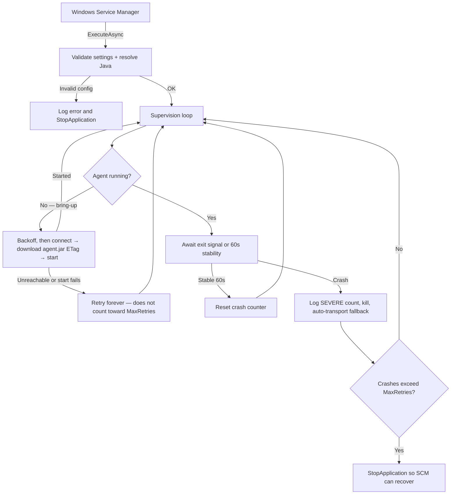

# JenkinsAsService

Run a Jenkins inbound (JNLP) agent as a native Windows Service — no login session, no scheduled tasks, no manual restarts.

[](https://github.com/EliorMachlev/JenkinsAsService/actions/workflows/build.yml)
[](https://github.com/EliorMachlev/JenkinsAsService/actions/workflows/codeql.yml)
[](LICENSE)
[](https://dotnet.microsoft.com/)

[](https://github.com/EliorMachlev/JenkinsAsService/releases/latest)
[](https://jenkinsasservice.machlev.org/index.html)

## Why This Exists

Jenkins inbound agents on Windows are painful: someone has to be logged in, `java -jar agent.jar` has to be running in a terminal, and when it crashes, nobody restarts it until builds start failing. Scheduled tasks are fragile. NSSM wrappers lack proper lifecycle management.

JenkinsAsService replaces all of that with a proper Windows Service built on .NET 10.

## Features

- **Auto-start on boot** — runs under a least-privilege virtual service account (`NT SERVICE\Jenkins`), no interactive login required
- **Event-driven watchdog** — detects agent death instantly (not polling), auto-recovers with exponential backoff (10s to 5min); a persistent crash-loop stops the service so Windows Service Recovery can act, while a merely-unreachable controller is retried indefinitely
- **Secret protection** — TPM 2.0 hardware-backed key, DPAPI machine/user-scope encryption, Windows Credential Manager, environment variables, or plaintext
- **Smart jar caching + integrity** — ETag conditional GET skips the download when `agent.jar` is unchanged; its SHA-256 is recorded on download and re-checked before reuse, so a tampered or corrupt cached jar is re-downloaded instead of launched
- **HTTP resilience** — Polly-based retry, circuit breaker, and timeout on all HTTP calls
- **Structured logging** — Serilog rolling file + Windows Event Log, with `ProcessId`/`MachineName` enrichment
- **CLEF JSON mode** — machine-parseable compact log format for Seq, Datadog, or any log aggregator
- **OpenTelemetry metrics** — opt-in OTLP export: restart counter, SEVERE event counter, .NET runtime metrics
- **Secret redaction** — agent secrets are scrubbed from all log output
- **178 unit tests** — xUnit + NSubstitute + FluentAssertions (incl. an end-to-end watchdog harness), CI on every push
- **6 security scans** — CodeQL (C# + Actions YAML), Semgrep, Gitleaks, PSScriptAnalyzer, Dependency Review, Trivy; all actions SHA-pinned
- **Single-file deploy** — self-contained `.exe` with R2R, compression, and embedded PDB symbols
- **Dual-arch releases** — x64 + x86 MSI installers, 7z/RAR archives, SHA256 checksums

## How It Works



## Quick Start

### Prerequisites

- **Windows 10** / Server 2016 or later
- A [supported JDK or OpenJDK](https://www.jenkins.io/doc/book/platform-information/support-policy-java/#running-jenkins-system) — set `JAVA_HOME` or configure the path in the installer
- A Jenkins controller with an inbound (JNLP) agent node configured

### Install

1. Download the `.msi` for your architecture from [Releases](https://github.com/EliorMachlev/JenkinsAsService/releases)
2. Run the installer — it walks you through install path, Jenkins URL, agent secret, and secret protection mode
3. Done — the service registers and starts automatically

The default install path is `C:\Program Files\Jenkins` (customizable in the UI). No .NET runtime needed — the binary is fully self-contained.

### Silent Install

For automated deployments, use `msiexec` with public properties:

```powershell
msiexec /i JenkinsAsService_x64.msi /qn `
    INSTALLFOLDER="D:\Jenkins" `
    JENKINS_URL="https://jenkins.example.com:8443" `
    JENKINS_SECRET="your-secret" `
    JENKINS_SECRET_MODE="Dpapi" `
    JENKINS_AGENT_NAME="" `
    JENKINS_JAVA_PATH=""
```

| Property | Required | Default | Description |
|---|:---:|---|---|
| `INSTALLFOLDER` | No | `C:\Program Files\Jenkins` | Installation directory |
| `JENKINS_URL` | Yes | — | Jenkins controller URL with explicit port |
| `JENKINS_SECRET` | Yes | — | JNLP agent secret |
| `JENKINS_SECRET_MODE` | No | `Dpapi` | `Dpapi`, `Tpm`, `CredentialManager`, `EnvironmentVariable`, or `Unprotected` |
| `JENKINS_AGENT_NAME` | No | Hostname | Agent node name in Jenkins |
| `JENKINS_JAVA_PATH` | No | `JAVA_HOME` | Path to JDK `bin` folder |

### Portable (Archive)

For environments where MSI installation isn't possible, download the `.7z` or `.rar` archive from [Releases](https://github.com/EliorMachlev/JenkinsAsService/releases):

1. Extract to a folder of your choice (e.g. `D:\Jenkins`)
2. Edit `appsettings.json` — fill in `Connection:Url`, `Secret:Value`, and any other settings
3. Register and start the service:

```powershell
# Least-privilege virtual service account (matches the MSI default). Use obj= LocalSystem only if required.
sc.exe create Jenkins binPath= "D:\Jenkins\JenkinsAsService.exe" start= auto obj= "NT SERVICE\Jenkins"
sc.exe failure Jenkins reset= 86400 actions= restart/10000/restart/10000/restart/10000
sc.exe start Jenkins
```

> A low-privilege account cannot create the Event Log source or write into `Program Files`. Run `update-secret --silent` once from an elevated prompt (it pre-creates the source) and grant the account Modify on the install folder. The service falls back to file-only logging if the Event Log source is unavailable.

To configure secret protection, run the CLI before starting:

```powershell
.\JenkinsAsService.exe update-secret --secret "your-secret" --url "https://jenkins:8443" --mode Dpapi --silent
```

To uninstall:

```powershell
sc.exe stop Jenkins
sc.exe delete Jenkins
```

## Configuration

All settings live in the `Jenkins` section of `appsettings.json`, grouped into topic sub-sections (`Connection`, `Secret`, `Agent`, `Hardening`, `Logging`, `Recovery`). Keys below are written as `Section:Key`.

| Setting | Required | Default | Description |
|---|:---:|---|---|
| `Connection:Url` | Yes | — | Full URL with an explicit port. A URL with no port is rejected; an explicit standard `:443` (e.g. a reverse-proxied controller) is accepted. Non-HTTPS URLs are allowed but warned (secret sent unencrypted) |
| `Connection:Method` | No | `Auto` | Agent transport: `Auto` (WebSocket first, fall back to direct TCP inbound), `WebSocket`, or `Https` (direct TCP inbound) |
| `Connection:AgentName` | No | Hostname | Node name in Jenkins (case-sensitive) |
| `Connection:ControllerCertThumbprint` | No | *(empty)* | SHA-256 thumbprint to pin the controller TLS cert (empty = chain validation) |
| `Secret:Value` | Yes | — | JNLP secret (or ciphertext / env-var name / credential target, per `Secret:Mode`) |
| `Secret:Mode` | No | `Unprotected` | `Unprotected`, `Dpapi`, `Tpm`, `EnvironmentVariable`, or `CredentialManager` |
| `Secret:DpapiScope` | No | `Machine` | `Machine` or `User` (only when `Secret:Mode` is `Dpapi`) |
| `Secret:ViaFile` | No | `true` | Pass the secret as `-secret @<file>` (ACL-restricted) instead of inline, keeping it out of the process table |
| `Agent:JavaPath` | No | `JAVA_HOME` | Path to JDK `bin` folder |
| `Agent:CustomArguments` | No | *(empty)* | Extra `java.exe` args (supports quoted values and escaped quotes) |
| `Agent:DataDirectory` | No | `%ProgramData%\JenkinsAsService` | Writable root for runtime data, separate from the read-only install folder: logs + secret at the root, cached `agent.jar` under `agent\`, Jenkins `-workDir` under `work\` |
| `Hardening:SanitizeEnvironment` | No | `true` | Launch the agent with a deny-by-default environment (curated allow-list only) |
| `Hardening:AllowedEnvironmentVariables` | No | *(empty)* | Extra env var names (`;`/`,`-separated) to pass through when sanitizing |
| `Logging:DebugMode` | No | `false` | Verbose Java agent output in logs |
| `Logging:CompactLog` | No | `false` | CLEF JSON output (`agent.clef`) instead of human-readable (`agent.log`) |
| `Logging:RetainedLogs` | No | `3` | Number of rolled log files to keep. Oldest are permanently deleted. |
| `Recovery:MaxRetries` | No | `0` | Max consecutive agent *crashes* before the service stops itself for SCM recovery. Unreachable-controller retries don't count. `0` = infinite |

### Secret Protection

Avoid storing plaintext secrets in config. Use `update-secret` to write the secret in your preferred mode:

```powershell
JenkinsAsService.exe update-secret --secret "your-secret" --url "https://jenkins:8443" --mode Dpapi --silent
```

| Mode | What `Secret:Value` contains | Resolution |
|---|---|---|
| `Unprotected` | Plaintext | Returned as-is |
| `Dpapi` | Base64 DPAPI ciphertext | `ProtectedData.Unprotect` (machine-scoped, non-portable) |
| `Tpm` | Base64 RSA ciphertext | `RSACng` decrypt via the TPM Platform Crypto Provider (non-exportable, machine-bound key) |
| `EnvironmentVariable` | Env var name | Reads machine-level environment variable (default: `JENKINS_SECRET`) |
| `CredentialManager` | Target name | Reads from Windows Credential Manager |

### OpenTelemetry

The `Telemetry` section is included in `appsettings.json` with `Enabled` set to `false`. To opt in, set `Enabled` to `true` and configure the OTLP endpoint:

```json
{
  "Telemetry": {
    "Enabled": true,
    "OtlpEndpoint": "http://localhost:4317",
    "ServiceName": "JenkinsAsService"
  }
}
```

Exports: `jenkins_agent_restarts_total`, `jenkins_agent_severe_events_total`, and .NET runtime metrics (GC, threads, memory).

## Logging

**File:** `agent.log` (human-readable) or `agent.clef` (CLEF JSON when `CompactLog: true`). Rolls at 10MB, keeps `RetainedLogs` backups (default: 3). Oldest files are permanently deleted.

**Windows Event Log:** Warnings and errors under source `JenkinsAsService` — crash evidence even when the file log is unavailable.

```powershell
# Tail the log (in the data folder, not the install folder)
Get-Content 'C:\ProgramData\JenkinsAsService\agent.log' -Tail 50 -Wait

# Check Event Log
Get-EventLog -LogName Application -Source JenkinsAsService -Newest 20
```

## Auto-Recovery

The watchdog is event-driven — it awaits the process exit signal, not a polling timer. The supervision loop has two states:

**Bring-up (no live agent)** — used for both first launch and recovery, so a transient outage at boot doesn't fault the service:

1. Wait with exponential backoff (10s, 20s, 40s, ... capped at 300s)
2. Test TCP connectivity — an **unreachable** controller is retried indefinitely and never counts toward `MaxRetries`
3. Refresh `agent.jar` via conditional GET (ETag/304); on a 304 the cached jar is SHA-256-verified (re-downloaded if it fails), then start a new agent process

**Live agent** — awaits the exit signal or a 60s stability timer:

1. On 60s of stability, reset the crash counter
2. On a **crash** (real exit before stability): log the exit code + SEVERE count, kill, and in `Auto` transport mode toggle WebSocket ↔ direct-TCP for the next attempt
3. Count the crash; if consecutive crashes exceed `Recovery:MaxRetries`, call `StopApplication()` so the service stops (rather than leaving a dead agent behind a `RUNNING` service)

The MSI installer configures Windows-level service recovery automatically: first, second, and third failures all restart the service after 10 seconds, with the failure counter resetting daily — so a crash-loop give-up is itself recovered by SCM.

## Troubleshooting

Log messages the service emits, by severity. **Errors** stop the service (or the current startup); **Warnings** are non-fatal — the watchdog keeps going.

| Log message / symptom | Type | Meaning & fix |
|---|:---:|---|
| `'Connection:Url' is a mandatory field` / `'Secret:Value' is a mandatory field` | Error | A required field in `appsettings.json` is empty — fill it in. |
| `Connection:Url must include an explicit port` | Error | Write the port explicitly: `https://jenkins:8443`. A URL with no port is rejected; an explicit standard `:443` is accepted. |
| `Connection:Url is not a valid absolute URL` | Error | Malformed URL — fix the value. |
| `Cannot find java.exe` | Error | Set `Agent:JavaPath` to the JDK `bin` folder, or set `JAVA_HOME`. |
| `DPAPI decryption failed` / `TPM decryption failed` / env var / credential not found | Error | The secret can't be decrypted or read on this machine — re-run `update-secret` (DPAPI/TPM keys are machine-bound and don't move between hosts). |
| `Service failed — shutting down` | Error | A non-transient failure (bad config, unresolvable secret, missing Java) — check the logged exception; the service stops so SCM recovery can restart it. |
| `Watchdog: Failed to download or start the agent — will retry` | Error | Jar download or process launch failed — check the jar URL, disk permissions, and Java. Retried automatically with backoff. |
| `Watchdog: Max retries (N) exceeded — the agent keeps crashing. Stopping the service.` | Error | A persistent crash-loop hit `Recovery:MaxRetries`; the service stops itself so Windows Service Recovery restarts it. Enable `DebugMode` and inspect the exit codes. |
| `Connection:Url uses http — agent secret will be sent unencrypted. Consider HTTPS.` | Warning | Plain HTTP sends the secret in cleartext. Use HTTPS. (Not blocked.) |
| `Connectivity test to <host>:<port> timed out` / `failed` | Warning | Controller unreachable — check firewall, DNS, the port, and that Jenkins is running. |
| `Watchdog: Jenkins unreachable — will keep retrying.` | Warning | Controller down during (re)connect. Retried indefinitely with backoff; does **not** count toward `MaxRetries`. |
| `Watchdog: Agent emitted N SEVERE event(s) before exiting.` | Warning | The agent logged SEVERE lines before dying — check the controller logs and that `AgentName`/`Secret` match the node exactly. |
| `Watchdog: <transport> transport failed to stabilise — falling back to <other>.` | Warning | `Connection:Method = Auto` toggled WebSocket ↔ direct-TCP inbound. If it flip-flops, make sure the intended transport is enabled on the controller. |
| `Could not restrict ACL on agent secret file` | Warning | The defense-in-depth ACL couldn't be applied; the secret file is still usable and already lives in a restricted folder — check the data-folder permissions. |
| Agent connects then disconnects randomly | Warning | `Connection:AgentName` and `Secret:Value` must match the Jenkins node config exactly; check network stability. |

## Building From Source

```powershell
dotnet restore -p:RestoreLockedMode=true
dotnet test -c Release
dotnet publish src/JenkinsAsService `
    --nologo -c Release `
    -p:RestoreLockedMode=true `
    -r win-x64 --self-contained true `
    -o publish/x64/ `
    -p:PublishSingleFile=true `
    -p:EnableCompressionInSingleFile=true `
    -p:PublishReadyToRun=true

# Optional: build WiX v5 MSI
dotnet build src/JenkinsAsService.Installer -c Release `
    -p:RestoreLockedMode=true -p:PublishDir=../../publish/x64/ -p:Version=1.0.0
```

## Security

- TLS 1.2+ enforced by default (.NET 10), with optional controller certificate pinning (`ControllerCertThumbprint`)
- Secrets encrypted at rest (TPM 2.0 hardware-backed key, DPAPI machine/user scope, or CredMgr), redacted from all logs, and passed to the agent off the command line via `-secret @<file>` so they never appear in the process table
- Least-privilege virtual service account, deny-by-default environment block for the agent child, and Win32 process-mitigation policies (no remote/low-IL/non-System32 DLL loads, extension-point injection disabled)
- Binary/data separation: read-only binaries in `Program Files`, writable runtime data in `ProgramData` — a malicious pipeline can't overwrite the service `.exe`. The cached `agent.jar` (+ SHA-256) lives in an `agent\` subfolder isolated from the build `work\` dir and is integrity-checked before each launch, so a build step can't swap the binary the watchdog runs
- Deterministic builds with locked NuGet restore and embedded PDB symbols
- CycloneDX **SBOM** generated in CI and attached to every release (with SHA-256 checksum)
- Unit tests run on every push and PR
- 6 security scans: **CodeQL** (C# SAST + Actions YAML), **Semgrep** (pattern SAST + secrets), **Gitleaks** (git history), **PSScriptAnalyzer** (PowerShell, via direct `pwsh` step), **Dependency Review** (CVE gate), **Trivy** (SCA, NVD + GHSA + OSV); all actions SHA-pinned against tag mutation
- Automated dual-arch release pipeline with SHA256 checksums

See [Security Policy](Security.md) for vulnerability reporting.

## License

[BSD 3-Clause](LICENSE)
