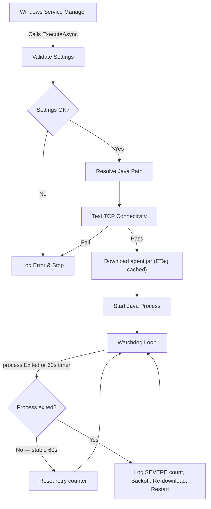

# JenkinsAsService

Run a Jenkins inbound (JNLP) agent as a native Windows Service — no login session, no scheduled tasks, no manual restarts.

[](https://github.com/EliorMachlev/JenkinsAsService/actions/workflows/build.yml)
[](https://github.com/EliorMachlev/JenkinsAsService/actions/workflows/codeql.yml)
[](LICENSE)
[](https://dotnet.microsoft.com/)

[](https://github.com/EliorMachlev/JenkinsAsService/releases/latest)
[](https://eliormachlev.github.io/JenkinsAsService/index.html)

## Why This Exists

Jenkins inbound agents on Windows are painful: someone has to be logged in, `java -jar agent.jar` has to be running in a terminal, and when it crashes, nobody restarts it until builds start failing. Scheduled tasks are fragile. NSSM wrappers lack proper lifecycle management.

JenkinsAsService replaces all of that with a proper Windows Service built on .NET 10.

## Features

- **Auto-start on boot** — runs under LocalSystem, no interactive login required
- **Event-driven watchdog** — detects agent death instantly (not polling), auto-recovers with exponential backoff (10s to 5min)
- **Secret protection** — DPAPI machine-scope encryption, Windows Credential Manager, environment variables, or plaintext
- **Smart jar caching** — ETag-based conditional GET skips the download when `agent.jar` is unchanged
- **HTTP resilience** — Polly-based retry, circuit breaker, and timeout on all HTTP calls
- **Structured logging** — Serilog rolling file + Windows Event Log, with `ProcessId`/`MachineName` enrichment
- **CLEF JSON mode** — machine-parseable compact log format for Seq, Datadog, or any log aggregator
- **OpenTelemetry metrics** — opt-in OTLP export: restart counter, SEVERE event counter, .NET runtime metrics
- **Secret redaction** — agent secrets are scrubbed from all log output
- **59 unit tests** — xUnit + NSubstitute + FluentAssertions, CI on every push
- **6 security scans** — CodeQL (C# + Actions YAML), Semgrep, Gitleaks, PSScriptAnalyzer, Dependency Review, Trivy; all actions SHA-pinned
- **Single-file deploy** — self-contained `.exe` with R2R, compression, and embedded PDB symbols
- **Dual-arch releases** — x64 + x86 MSI installers, 7z/RAR archives, SHA256 checksums

## How It Works



## Quick Start

### Prerequisites

- **Windows 10** / Server 2016 or later
- A [supported JDK or OpenJDK](https://www.jenkins.io/doc/book/platform-information/support-policy-java/#running-jenkins-system) — set `JAVA_HOME` or configure the path in the installer
- A Jenkins controller with an inbound (JNLP) agent node configured

### Install

1. Download the `.msi` for your architecture from [Releases](https://github.com/EliorMachlev/JenkinsAsService/releases)
2. Run the installer — it walks you through install path, Jenkins URL, agent secret, and secret protection mode
3. Done — the service registers and starts automatically

The default install path is `C:\Program Files\Jenkins` (customizable in the UI). No .NET runtime needed — the binary is fully self-contained.

### Silent Install

For automated deployments, use `msiexec` with public properties:

```powershell
msiexec /i JenkinsAsService_1.0.4_x64.msi /qn `
    INSTALLFOLDER="D:\Jenkins" `
    JENKINS_URL="https://jenkins.example.com:8443" `
    JENKINS_SECRET="your-secret" `
    JENKINS_SECRET_MODE="EnvironmentVariable" `
    JENKINS_AGENT_NAME="" `
    JENKINS_JAVA_PATH=""
```

| Property | Required | Default | Description |
|---|:---:|---|---|
| `INSTALLFOLDER` | No | `C:\Program Files\Jenkins` | Installation directory |
| `JENKINS_URL` | Yes | — | Jenkins controller URL with explicit port |
| `JENKINS_SECRET` | Yes | — | JNLP agent secret |
| `JENKINS_SECRET_MODE` | No | `EnvironmentVariable` | `EnvironmentVariable`, `Dpapi`, `CredentialManager`, or `Unprotected` |
| `JENKINS_AGENT_NAME` | No | Hostname | Agent node name in Jenkins |
| `JENKINS_JAVA_PATH` | No | `JAVA_HOME` | Path to JDK `bin` folder |

### Portable (Archive)

For environments where MSI installation isn't possible, download the `.7z` or `.rar` archive from [Releases](https://github.com/EliorMachlev/JenkinsAsService/releases):

1. Extract to a folder of your choice (e.g. `D:\Jenkins`)
2. Edit `appsettings.json` — fill in `JenkinsURL`, `AgentSecret`, and any other settings
3. Register and start the service:

```powershell
sc.exe create Jenkins binPath= "D:\Jenkins\JenkinsAsService.exe" start= auto obj= LocalSystem
sc.exe failure Jenkins reset= 86400 actions= restart/10000/restart/10000/restart/10000
sc.exe start Jenkins
```

To configure secret protection, run the CLI before starting:

```powershell
.\JenkinsAsService.exe update-secret --secret "your-secret" --url "https://jenkins:8443" --mode Dpapi --silent
```

To uninstall:

```powershell
sc.exe stop Jenkins
sc.exe delete Jenkins
```

## Configuration

All settings live in the `Jenkins` section of `appsettings.json`.

| Setting | Required | Default | Description |
|---|:---:|---|---|
| `JenkinsURL` | Yes | — | Full URL with explicit port (default ports 80/443 are rejected) |
| `AgentSecret` | Yes | — | JNLP secret from Jenkins node config (case-sensitive) |
| `SecretMode` | No | `Unprotected` | `Unprotected`, `Dpapi`, `EnvironmentVariable`, or `CredentialManager` |
| `AgentName` | No | Hostname | Node name in Jenkins (case-sensitive) |
| `JavaPath` | No | `JAVA_HOME` | Path to JDK `bin` folder |
| `CustomArguments` | No | *(empty)* | Extra `java.exe` args (supports quoted values and escaped quotes) |
| `DebugMode` | No | `false` | Verbose Java agent output in logs |
| `CompactLog` | No | `false` | CLEF JSON output (`agent.clef`) instead of human-readable (`agent.log`) |
| `RetainedLogs` | No | `3` | Number of rolled log files to keep. Oldest are permanently deleted. |
| `MaxRetries` | No | `0` | Max recovery attempts before giving up (`0` = infinite) |

### Secret Protection

Avoid storing plaintext secrets in config. Use `update-secret` to write the secret in your preferred mode:

```powershell
JenkinsAsService.exe update-secret --secret "your-secret" --url "https://jenkins:8443" --mode Dpapi --silent
```

| Mode | What `AgentSecret` contains | Resolution |
|---|---|---|
| `Unprotected` | Plaintext | Returned as-is |
| `Dpapi` | Base64 DPAPI ciphertext | `ProtectedData.Unprotect` (machine-scoped, non-portable) |
| `EnvironmentVariable` | Env var name | Reads machine-level environment variable (default: `JENKINS_SECRET`) |
| `CredentialManager` | Target name | Reads from Windows Credential Manager |

### OpenTelemetry

The `Telemetry` section is included in `appsettings.json` with `Enabled` set to `false`. To opt in, set `Enabled` to `true` and configure the OTLP endpoint:

```json
{
  "Telemetry": {
    "Enabled": true,
    "OtlpEndpoint": "http://localhost:4317",
    "ServiceName": "JenkinsAsService"
  }
}
```

Exports: `jenkins_agent_restarts_total`, `jenkins_agent_severe_events_total`, and .NET runtime metrics (GC, threads, memory).

## Logging

**File:** `agent.log` (human-readable) or `agent.clef` (CLEF JSON when `CompactLog: true`). Rolls at 10MB, keeps `RetainedLogs` backups (default: 3). Oldest files are permanently deleted.

**Windows Event Log:** Warnings and errors under source `JenkinsAsService` — crash evidence even when the file log is unavailable.

```powershell
# Tail the log
Get-Content 'C:\Program Files\Jenkins\agent.log' -Tail 50 -Wait

# Check Event Log
Get-EventLog -LogName Application -Source JenkinsAsService -Newest 20
```

## Auto-Recovery

The watchdog is event-driven — it awaits the process exit signal, not a polling timer. On agent death:

1. Detects failure instantly via `process.Exited` event
2. Logs exit code and SEVERE event count from that run
3. Waits with exponential backoff (10s, 20s, 40s, ... capped at 300s)
4. Tests TCP connectivity — skips restart if the controller is unreachable
5. Re-downloads `agent.jar` via conditional GET (ETag/304)
6. Starts a new agent process
7. Resets retry counter after 60s of stability

The MSI installer configures Windows-level service recovery automatically: first, second, and third failures all restart the service after 10 seconds, with the failure counter resetting daily.

## Troubleshooting

| Symptom | Fix |
|---|---|
| Service starts and stops immediately | Check `agent.log` — mandatory fields (`JenkinsURL`, `AgentSecret`) are likely empty |
| "must include an explicit port" | Add the port explicitly: `https://jenkins:8443` (80/443 are rejected) |
| "Cannot reach Jenkins" | Verify URL, port, firewall, DNS, and that Jenkins is running |
| "Cannot find java.exe" | Set `JavaPath` to the JDK `bin` folder, or set `JAVA_HOME` |
| Agent connects then disconnects | `AgentName` and `AgentSecret` must match Jenkins node config exactly |
| Watchdog keeps restarting | Enable `DebugMode: true` and look for patterns in exit codes |

## Building From Source

```powershell
dotnet restore -p:RestoreLockedMode=true
dotnet test -c Release
dotnet publish src/JenkinsAsService `
    --nologo -c Release `
    -p:RestoreLockedMode=true `
    -r win-x64 --self-contained true `
    -o publish/x64/ `
    -p:PublishSingleFile=true `
    -p:EnableCompressionInSingleFile=true `
    -p:PublishReadyToRun=true

# Optional: build WiX v5 MSI
dotnet build src/JenkinsAsService.Installer -c Release `
    -p:RestoreLockedMode=true -p:PublishDir=../../publish/x64/ -p:Version=1.0.0
```

## Security

- TLS 1.2+ enforced by default (.NET 10)
- Secrets encrypted at rest (DPAPI/CredMgr) and redacted from all logs
- Deterministic builds with locked NuGet restore and embedded PDB symbols
- 59 unit tests run on every push and PR
- 6 security scans: **CodeQL** (C# SAST + Actions YAML), **Semgrep** (pattern SAST + secrets), **Gitleaks** (git history), **PSScriptAnalyzer** (PowerShell, via direct `pwsh` step), **Dependency Review** (CVE gate), **Trivy** (SCA, NVD + GHSA + OSV); all actions SHA-pinned against tag mutation
- Automated dual-arch release pipeline with SHA256 checksums

See [Security Policy](Security.md) for vulnerability reporting.

## License

[BSD 3-Clause](LICENSE)
